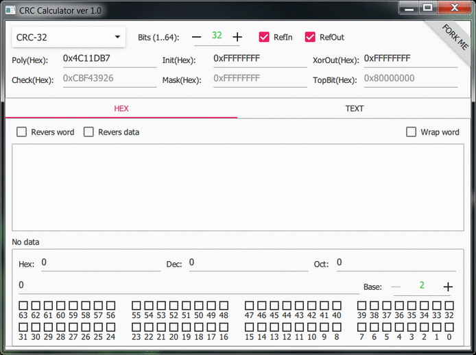

# CRC Calculator on Qt


## Description

CRC Calculator on Qt based of **[uCRC_t](https://github.com/KoynovStas/uCRC_t)** C++ class for calculation CRC sizes(width) 1-64 bits.


<p align="center">
</img>
</p>


### Features

- Common:
	- Support GUI mode
	- Support console mode (see cmd --help)

- CRC for Hex:
	- Any word size
	- Any word separators (useful for insertion of Hex data separated by [,:;#$% ... etc])
	- Reverse words
	- Reverse all data
	- Read data from file in console mode (see cmd --hex_file)

- CRC for Text:
	- Support encodings + Unicode
	- Support [Unicode byte order mark (BOM)](https://en.wikipedia.org/wiki/Byte_order_mark)
	- Different [format of the end of line](https://en.wikipedia.org/wiki/Newline)
	- Read data from file in console mode (see cmd --text_file)
	
- Result:
	- Any format (Dec, Hex, Oct + any base: 2..36)
	- A convenient graphical representation of bits


## Build

To build only bin (debug and release) use `crc_calculator.pro`:

```console
qmake crc_calculator.pro
make
```


To build bin and tests use `crc_calculator_and_tests.pro`:

```console
qmake crc_calculator_and_tests.pro
make
```


To run tests:

```console
make check
```


## License

[BSD-3-Clause](./LICENSE).


## Copyright
Copyright (C) 2016 Koynov Stas - skojnov@yandex.ru
