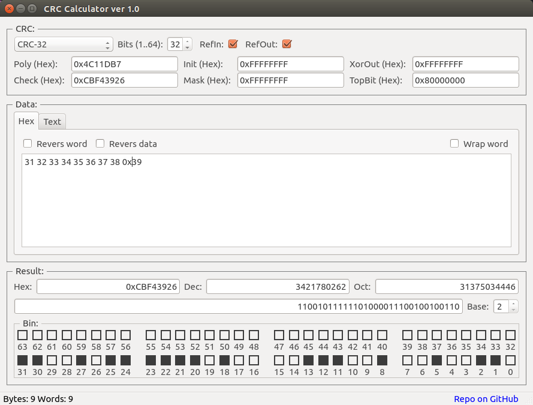
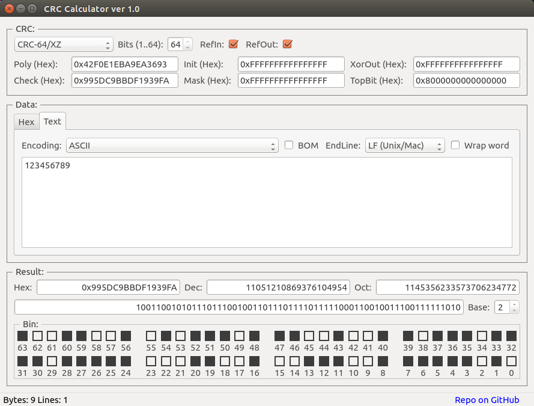

# CRC Calculator on Qt


## Description

CRC Calculator on Qt based of **[uCRC_t](https://github.com/KoynovStas/CRC_CPP_Class)** C++ class for calculation CRC sizes(width) 1-64 bits.







## Build

```console
qmake
make
```


<br/>
## License

[BSD](./LICENSE).


## Copyright
Copyright (C) 2016 Koynov Stas - skojnov@yandex.ru
